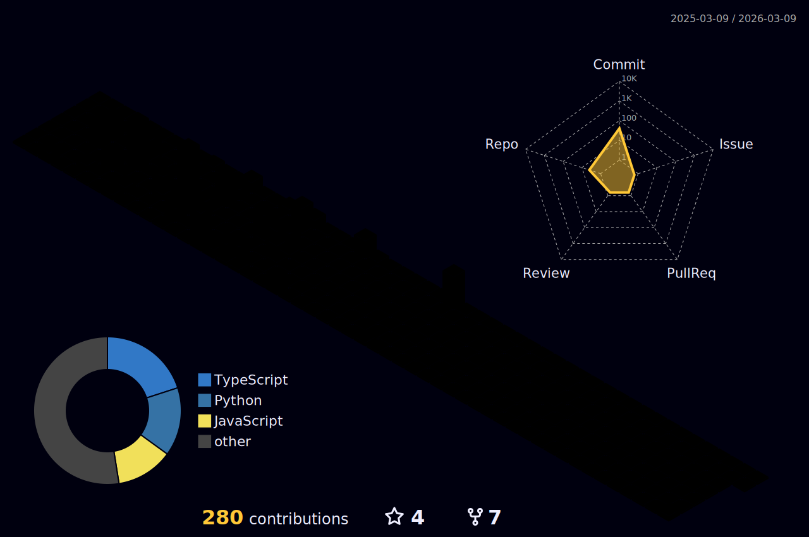

<!-- Futuristic GitHub Profile README for Ram9199 -->

<h1 align="center">🚀 Sriram Prakhya</h1>
<h3 align="center">AI Architect • Multi-Agent RAG • Futurist Engineer</h3>

  
  
  
  

---

  

---

## 🧠 About Me
- Architecting **multi-agent RAG** and enterprise AI platforms (LangChain • AutoGen • Azure OpenAI • Qdrant/pgvector).
- Research + open-source: **fine-tuning LLaMA/Falcon/MPT** with PEFT/LoRA; RAG pipelines; ONNX/TorchScript.
- Founder of **Lluvia OS** (AOSP ROM for 15+ devices, XDA/YouTube featured).
- Author of *From RAG to REFRAG: Building Trustworthy AI in Healthcare* → introducing **Refang orchestration**.

---

## 📊 Futuristic Dashboard

  
  

  

  

  

---

## 📝 Latest from Medium
<!-- MEDIUM:START -->
- [From RAG to REFRAG: Building Trustworthy AI in Healthcare](https://medium.com/venkataprakhya7/from-rag-to-refrag-building-trustworthy-ai-in-healthcare-1b63dec45f31?source=rss-2af487abd7db------2)
- [This AI Reads Your Face and Tells You If You’re Burned Out Built in 3 Days](https://medium.com/@venkataprakhya7/this-ai-reads-your-face-and-tells-you-if-youre-burned-out-built-in-3-days-05c134a00584?source=rss-2af487abd7db------2)
- [What to Expect from AI in 2025: Predictions and Trends](https://medium.com/@venkataprakhya7/what-to-expect-from-ai-in-2025-predictions-and-trends-3e1f754801d9?source=rss-2af487abd7db------2)
- [Building an Anomaly Detection System Using Data Science, Machine Learning, and AI](https://medium.com/venkataprakhya7/building-an-anomaly-detection-system-using-data-science-machine-learning-and-ai-7aa18aaf4af5?source=rss-2af487abd7db------2)
- [OpenAI’s “Operator” The New Frontier in Autonomous AI Agents](https://medium.com/venkataprakhya7/openais-operator-the-new-frontier-in-autonomous-ai-agents-a84bb74b5a0f?source=rss-2af487abd7db------2)
<!-- MEDIUM:END -->

---

## 🛠️ Tech Stack

  
  
  
  
  
  

---

## 🔮 Future Lab
- Building **Refang orchestration** → trustworthy AI pipelines.
- Multi-agent **healthcare copilots** that think like teams.
- Exploring **Android–AI convergence** (ROMs infused with AI).
- Writing the future on [Medium](https://medium.com/@venkataprakhya7).

---

## 🏆 Trophies

  

---

## 🌌 3D Contributions

  

---

<b>⚡ Let’s build systems the future kneels to ⚡</b>

