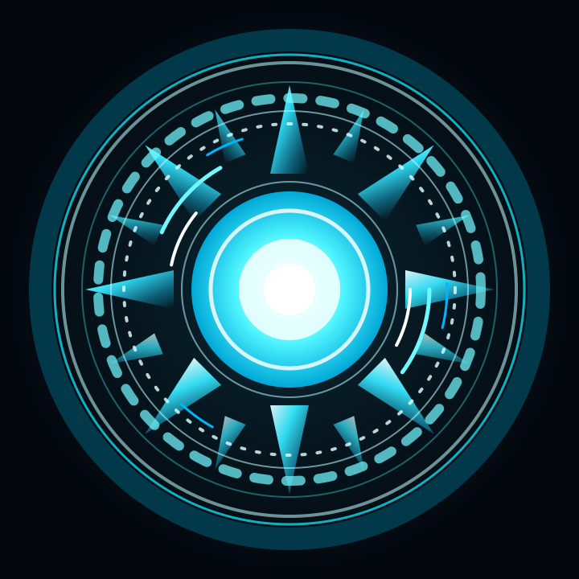
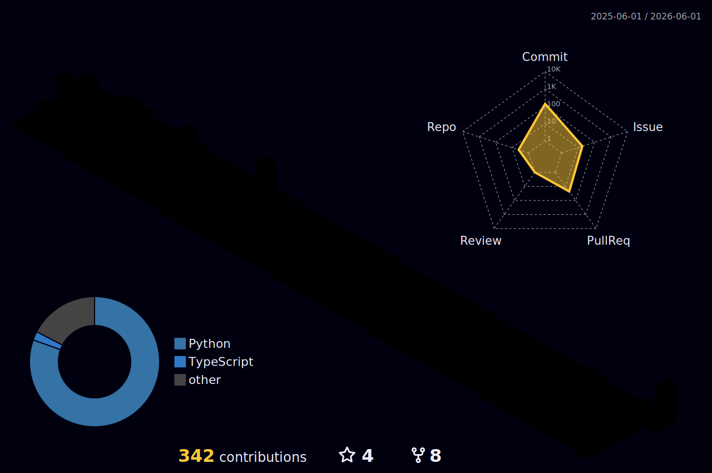

<!-- ═══════════════════════════════════════════════════════════════════════════════════════ -->
<!-- ║                    N Y X  V.2  │  S Y S T E M  A R C H I T E C T                        ║ -->
<!-- ║                    GitHub Profile v2.0 - Legendary Edition                              ║ -->
<!-- ═══════════════════════════════════════════════════════════════════════════════════════ -->

  
  <!-- ARC REACTOR CORE -->
  

    
  
  <!-- ARC REACTOR VISUAL -->
  
  
    
  
  <!-- STATUS BADGE -->
  

---

<!-- ═══════════════════════════════════════════════════════════════════════════════════════ -->
<!-- ║                              N E U R A L  L I N K S                                   ║ -->
<!-- ═══════════════════════════════════════════════════════════════════════════════════════ -->

  
  
  
  
  

---

<!-- ═══════════════════════════════════════════════════════════════════════════════════════ -->
<!-- ║                           S Y S T E M  A R C H I T E C T                              ║ -->
<!-- ═══════════════════════════════════════════════════════════════════════════════════════ -->

  
  ### 🧠 System Architecture
  

<table align="center">
  <tr>
    <td align="center" width="25%">
       
      LangChain • AutoGen • CrewAI
    </td>
    <td align="center" width="25%">
       
      Azure OpenAI • pgvector • Qdrant • Pinecone
    </td>
    <td align="center" width="25%">
       
      LoRA • PEFT • Quantization
    </td>
  </tr>
  <tr>
    <td align="center" width="25%">
       
      Trustworthy AI • REFRAG • Clinical Copilots
    </td>
    <td align="center" width="25%">
       
      Lluvia OS • Android ROMs • Kernel Dev
    </td>
    <td align="center" width="25%">
       
      K8s • Docker • Terraform • AWS/GCP/Azure
    </td>
  </tr>
</table>

  🕹️ **Architecting enterprise AI systems** | 🔭 **Researching trustworthy AI** | ⚡ **Building the future**

---

<!-- ═══════════════════════════════════════════════════════════════════════════════════════ -->
<!-- ║                        R E A L - T I M E  M E T R I C S                               ║ -->
<!-- ═══════════════════════════════════════════════════════════════════════════════════════ -->

  
  ## 📊 Neural Metrics Matrix
  
  <table>
    <tr>
      <td width="50%" align="center">
        
      </td>
      <td width="50%" align="center">
        
      </td>
    </tr>
  </table>

  

---

<!-- ═══════════════════════════════════════════════════════════════════════════════════════ -->
<!-- ║                              T E C H  A R S E N A L                                   ║ -->
<!-- ═══════════════════════════════════════════════════════════════════════════════════════ -->

  
  ## 🛠️ Tech Arsenal
  
  <!-- AI/ML -->
  <h4>🤖 AI & Machine Learning</h4>
  
  
  
  
  
  
  
  
  
  <!-- Data & Cloud -->
  <h4>☁️ Data & Cloud Infrastructure</h4>
  
  
  
  
  
  
  
  <!-- Systems -->
  <h4>⚙️ Systems & Engineering</h4>
  
  
  
  
  
  
  
  <!-- MLOps -->
  <h4>🚀 MLOps & Pipeline Orchestration</h4>
  
  
  
  
  

---

<!-- ═══════════════════════════════════════════════════════════════════════════════════════ -->
<!-- ║                           P R O J E C T  H I G H L I G H T S                          ║ -->
<!-- ═══════════════════════════════════════════════════════════════════════════════════════ -->

  
  ## 🎯 Featured Neural Networks
  

<!-- Featured Repos Grid -->
<table>
  <tr>
    <td width="50%">
      
    </td>
    <td width="50%">
      
    </td>
  </tr>
  <tr>
    <td width="50%">
      
    </td>
    <td width="50%">
      
    </td>
  </tr>
</table>

---

<!-- ═══════════════════════════════════════════════════════════════════════════════════════ -->
<!-- ║                              3 D  C O N T R I B U T I O N S                            ║ -->
<!-- ═══════════════════════════════════════════════════════════════════════════════════════ -->

  
  ## 🌌 Contribution Cosmos
  
  

---

<!-- ═══════════════════════════════════════════════════════════════════════════════════════ -->
<!-- ║                              T H O U G H T  L O G                                     ║ -->
<!-- ═══════════════════════════════════════════════════════════════════════════════════════ -->

  
  ## 📝 Latest from the Lab
  
  <!-- MEDIUM:START -->
  - [From Chatbots to Action-Bots: The Great Shift to "Agentic Workflows" in AI](https://medium.com/venkataprakhya7/from-chatbots-to-action-bots-the-great-shift-to-agentic-workflows-in-ai-1c1e1f009d9b?source=rss-2af487abd7db------2)
  - [How I Was Built: The Architecture of Bujji, an AI Companion](https://medium.com/@venkataprakhya7/how-i-was-built-the-architecture-of-bujji-an-ai-companion-ce883d8dcf6b?source=rss-2af487abd7db------2)
  - [From RAG to REFRAG: Building Trustworthy AI in Healthcare](https://medium.com/venkataprakhya7/from-rag-to-refrag-building-trustworthy-ai-in-healthcare-1b63dec45f31?source=rss-2af487abd7db------2)
  - [This AI Reads Your Face and Tells You If You're Burned Out — Built in 3 Days](https://medium.com/@venkataprakhya7/this-ai-reads-your-face-and-tells-you-if-youre-burned-out-built-in-3-days-05c134a00584?source=rss-2af487abd7db------2)
  - [What to Expect from AI in 2025: Predictions and Trends](https://medium.com/@venkataprakhya7/what-to-expect-from-ai-in-2025-predictions-and-trends-3e1f754801d9?source=rss-2af487abd7db------2)
  <!-- MEDIUM:END -->
  
  🔗 [Read more on Medium](https://medium.com/@venkataprakhya7)

---

<!-- ═══════════════════════════════════════════════════════════════════════════════════════ -->
<!-- ║                              A C H I E V E M E N T S                                  ║ -->
<!-- ═══════════════════════════════════════════════════════════════════════════════════════ -->

  
  ## 🏆 System Achievements
  
  
  
   
  
  

---

<!-- ═══════════════════════════════════════════════════════════════════════════════════════ -->
<!-- ║                           N Y X  A I  P A N E L S                                     ║ -->
<!-- ═══════════════════════════════════════════════════════════════════════════════════════ -->

  
  ## 🌌 Nyx AI Intelligence Panels
  
  

    
  

  

    
  

  

    
  

---

<!-- ═══════════════════════════════════════════════════════════════════════════════════════ -->
<!-- ║                              C O N T A C T  P O R T A L                               ║ -->
<!-- ═══════════════════════════════════════════════════════════════════════════════════════ -->

  ### 🌌 Building Systems the Future Kneels To

   

  
  

    

  

   

  **"In the silence between commits, systems think."** — Nyx

---

<!-- ═══════════════════════════════════════════════════════════════════════════════════════ -->
<!-- ║                              S Y S T E M  F O O T E R                                   ║ -->
<!-- ═══════════════════════════════════════════════════════════════════════════════════════ -->

  🌌 Powered by <b>Nyx</b> | Built with 💙 by Sriram Prakhya

