<!-- Futuristic GitHub Profile README for Ram9199 -->

<h1 align="center">🚀 Sriram Prakhya</h1>
<h3 align="center">AI Architect • Multi-Agent RAG • Futurist Engineer</h3>

  
  
  
  

---

  

---

## 🧠 About Me
- Architecting **multi-agent RAG** and enterprise AI platforms (LangChain • AutoGen • Azure OpenAI • Qdrant/pgvector).
- Research + open-source: **fine-tuning LLaMA/Falcon/MPT** with PEFT/LoRA; RAG pipelines; ONNX/TorchScript.
- Founder of **Lluvia OS** (AOSP ROM for 15+ devices, XDA/YouTube featured).
- Author of *From RAG to REFRAG: Building Trustworthy AI in Healthcare* → introducing **Refang orchestration**.

---

## 📊 Futuristic Dashboard

  
  

  

  

  

---

## 🛠️ Tech Stack

  
  
  
  
  
  

---
## 🔮 Future Lab
- Building **Refang orchestration** → trustworthy AI pipelines.
- Multi-agent **healthcare copilots** that think like teams.
- Exploring **Android–AI convergence** (ROMs infused with AI).
- Writing the future on [Medium](https://medium.com/@venkataprakhya7).

---

⚡ Let’s build systems the future kneels to ⚡

