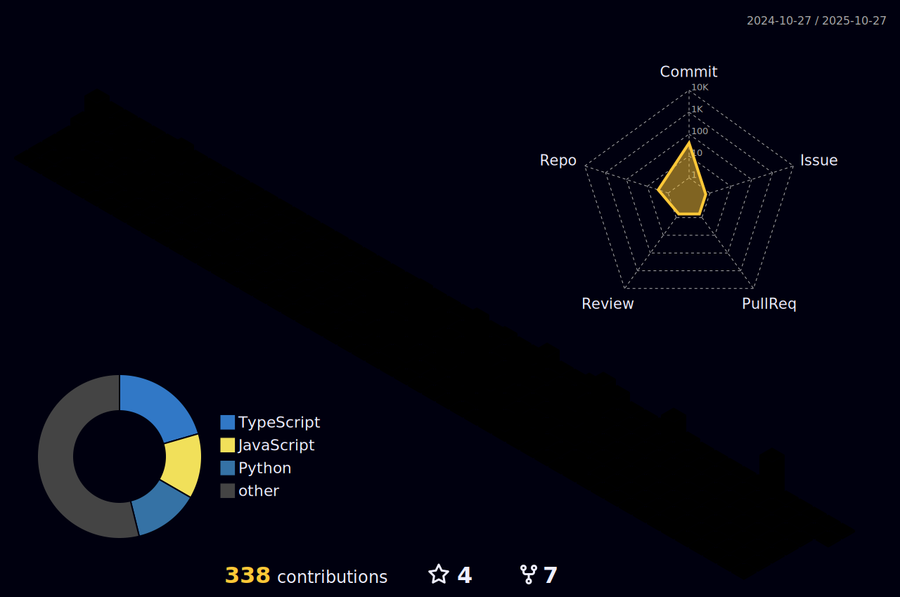

<!-- Ultra-Legendary GitHub Profile README -->

<h1 align="center">
  
</h1>

  

---

  
  
  
  

---

## 🧠 About Me
- 🕹 Architecting **multi-agent RAG** & enterprise AI systems (LangChain • AutoGen • Azure OpenAI • pgvector/Qdrant).  
- 🔭 Research & open source: **LLM fine-tuning (LoRA, PEFT)** • **Trustworthy AI pipelines** • **Healthcare copilots**.  
- ⚡ Built **Lluvia OS** (15+ devices, XDA/YouTube featured).  
- 📝 Author: *From RAG to REFRAG — Trustworthy AI in Healthcare*.  

---

## 📊 My Futuristic Dashboard

  
  

  

---

## 🔮 Future Lab
- 🚀 Pioneering **Refang orchestration** → scalable, safe AI pipelines.  
- 🧬 Multi-agent **healthcare copilots** with real-world deployment.  
- 📱 AI-infused Android ROMs (systems that learn).  
- ✍️ Writing tomorrow’s playbook on [Medium](https://medium.com/@venkataprakhya7).  

---

## 🛠️ Tech Arsenal

  
  
  
  
  
  

---

## 🏆 Achievements & Trophies

  

---

## 🌌 3D Contribution Universe

  

---

  

<b>⚡ Building Systems the Future Kneels To ⚡</b>

